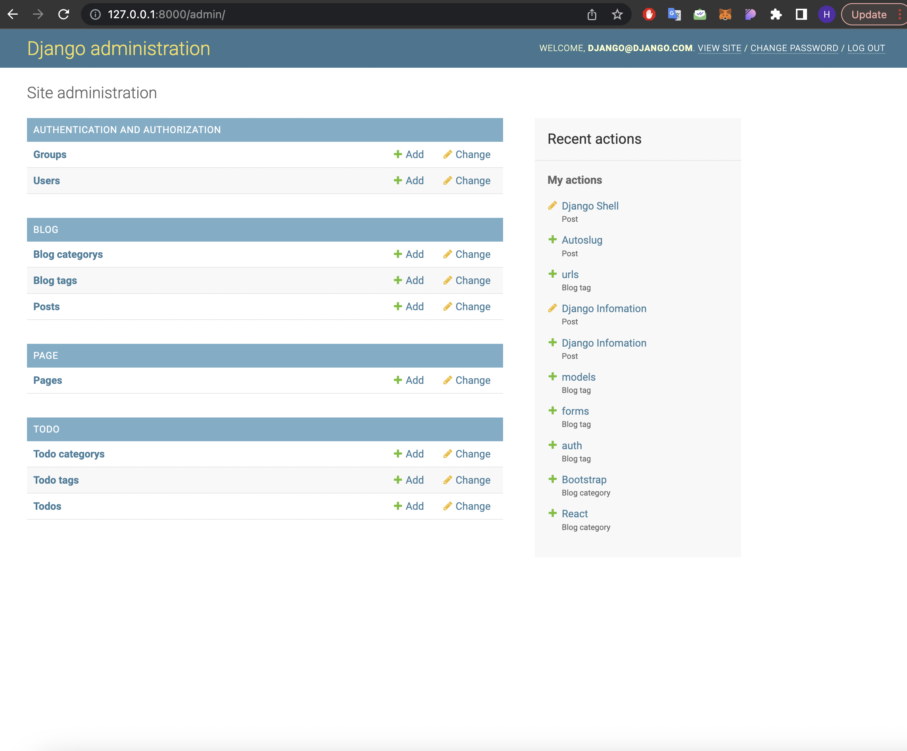
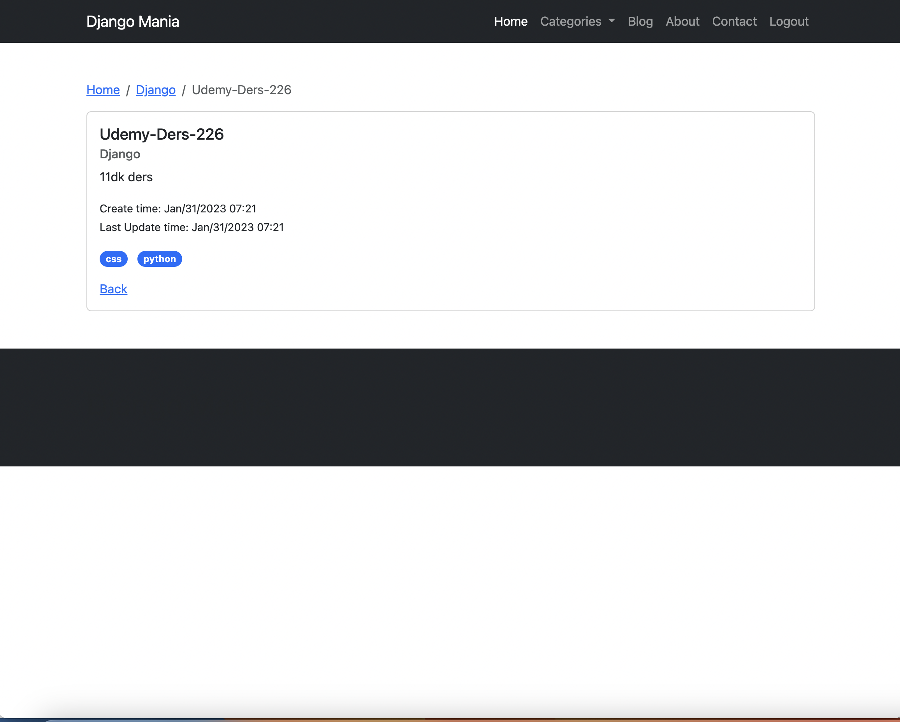
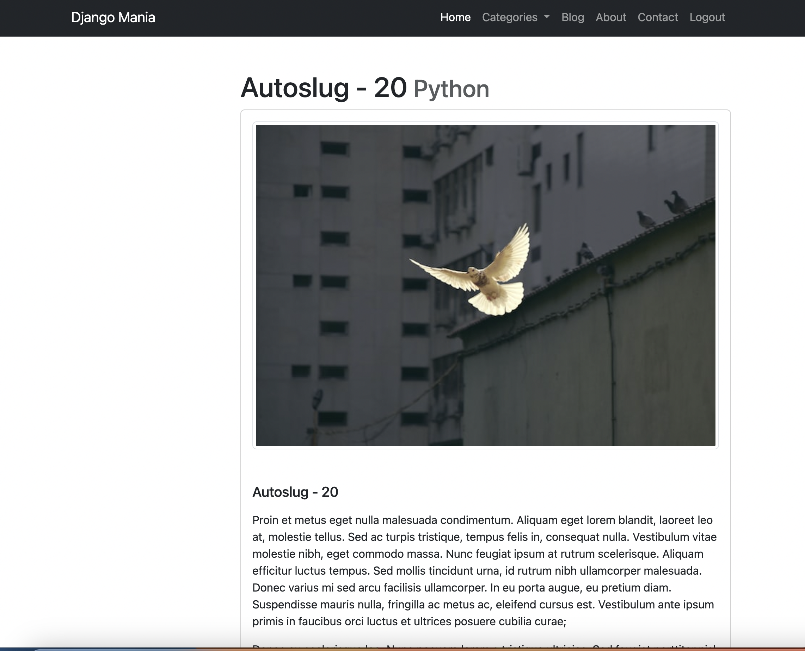

# This project is Blog App with Todo List

## Project Goals
- Combining bootstrap design files with todo app
- Development of Django model structure
- Django ORM usage
- Using Slugs
- global_context_processors usage
- Media Root Usage
- Tinymce usage
- Pagination

## Requirements
```Django==4.1.5
django-autoslug==1.9.8
django-tinymce==3.5.0
python-slugify==8.0.0
```
## You can install packages with
```pip install -r requirements.txt```

## You can run the project with
```python manage.py runserver```

## Picture Belongs to Site
### Admin Page


### Home Page


### Todo Details Page


### Blog Post Details Page


